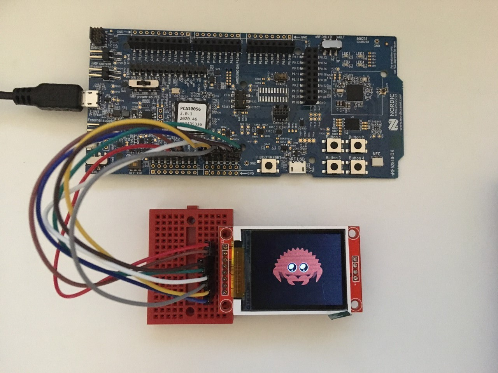
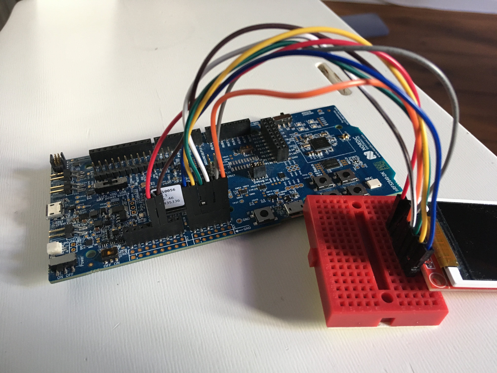
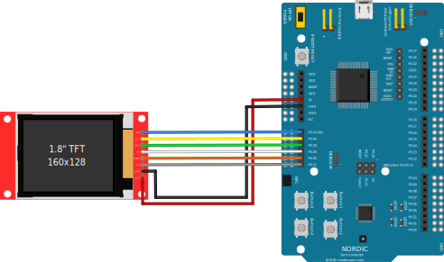
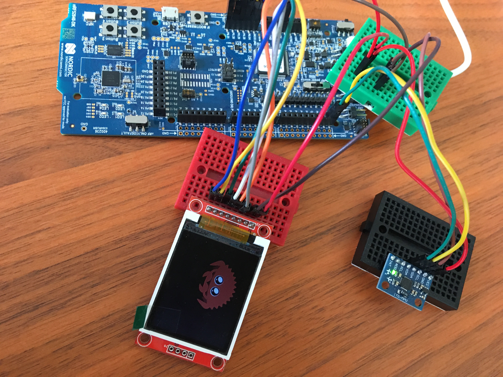
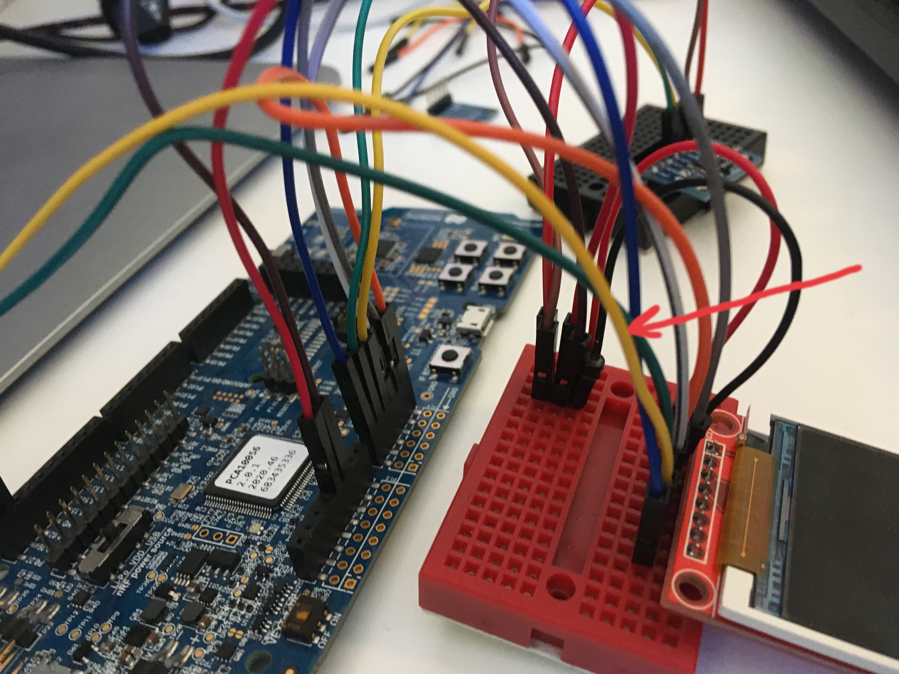
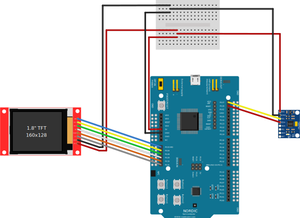
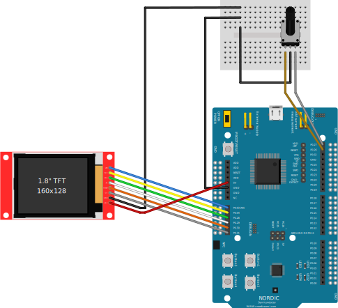

# Embassy examples

## Board buttons and screen

The first example uses the nRF52840-DK and a [TFT LCD Display](https://www.amazon.com/Display-Module-ST7735-128x160-STM32/dp/B07BFV69DZ) (specs: 1.8 inch Color TFT LCD Display Module 128*160 Interface SPI Drive ST7735, can be bought at Amazon but really from anywhere.

You can move Ferris around with the buttons. It will appear on the other side of the screen if you scroll too long :)
### Connections

<p align="center">

</p>

<p align="center">

</p>

<p align="center">

</p>


### Run the demo

`$ cargo rb buttons`


### First video

https://vimeo.com/705697973

<div style="padding:56.25% 0 0 0;position:relative;"><iframe src="https://player.vimeo.com/video/705697973?h=689ef2836e&amp;badge=0&amp;autopause=0&amp;player_id=0&amp;app_id=58479" frameborder="0" allow="autoplay; fullscreen; picture-in-picture" allowfullscreen style="position:absolute;top:0;left:0;width:100%;height:100%;" title="async/await Embedded 1"></iframe></div><script src="https://player.vimeo.com/api/player.js"></script>

## Accelerometer demo

The second example uses the same screen and board, and adds a [MPU6050 accelerometer](https://www.electrokit.com/en/product/mpu-6050-accelerometer-3-axel-monterad-pa-kort-2/).

It has I2C and we use only the pins `SDA`, `SCK`, `GND` and `VCC`.

Ferris can be moved on the screen by tilting the accelerometer, and stops at the border of the screen.

<p align="center">

</p>
<p align="center">

</p>

That seems like a lot of cables but the important thing is that the accelerometer and the screen must share `5V` and `GND` pins.

<p align="center">

</p>

### Run the demo

`$ cargo rb gyro`

### Async driver

Check the [async driver](https://github.com/kalkyl/mpu6050-async.git) for this program!

### Second video

https://vimeo.com/705697951

<div style="padding:56.25% 0 0 0;position:relative;"><iframe src="https://player.vimeo.com/video/705697951?h=d4fc991c7b&amp;badge=0&amp;autopause=0&amp;player_id=0&amp;app_id=58479" frameborder="0" allow="autoplay; fullscreen; picture-in-picture" allowfullscreen style="position:absolute;top:0;left:0;width:100%;height:100%;" title="async/await Embedded 2"></iframe></div><script src="https://player.vimeo.com/api/player.js"></script>


## Rotary encoder demo

The third example uses the same screen and board, with a rotary encoder [EC11](https://www.digikey.se/sv/products/detail/bourns-inc./PEC11R-4220F-S0024/4499660?utm_adgroup=Encoders&utm_source=google&utm_medium=cpc&utm_campaign=Shopping_Product_Sensors%2C%20Transducers&utm_term=&productid=4499660).

It does not have a `VCC` pin because of how the rotary encoder works (it works as switches that shorts to GND).

In this demo, Ferris does not move but you can dim the screen with the encoder.


<p align="center">

</p>

The rotary encoder and the screen must share the `GND` pin.

<p align="center">

</p>

### Run the demo

`$ cargo rb qdec`


### Third video

https://vimeo.com/725265205

<div style="padding:56.25% 0 0 0;position:relative;"><iframe src="https://player.vimeo.com/video/725265205?h=4a91292cf1&amp;badge=0&amp;autopause=0&amp;player_id=0&amp;app_id=58479" frameborder="0" allow="autoplay; fullscreen; picture-in-picture" allowfullscreen style="position:absolute;top:0;left:0;width:100%;height:100%;" title="async/await Embedded 3"></iframe></div><script src="https://player.vimeo.com/api/player.js"></script>

## Make your own image


If you want to insert your own image, find a `.png` and convert with ImageMagick:

`$ convert <your_image>.png -type truecolor -define bmp:subtype=RGB565 -depth 16 -strip -resize 86x64 <new_bmp>.bmp`


Then replace your image in the code:

```rust
let raw_image: Bmp<Rgb565> =
 Bmp::from_slice(include_bytes!("../../assets/<new_bmp>.bmp")).unwrap();
```